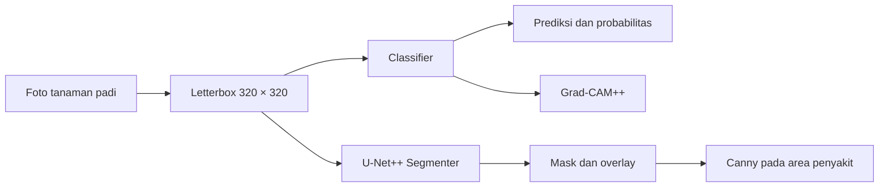

# RiceLeaf AI

[](https://www.python.org/)
[](https://pytorch.org/)
[](https://streamlit.io/)

RiceLeaf AI adalah aplikasi web berbasis deep learning untuk mengidentifikasi dan memvisualisasikan area penyakit pada citra tanaman padi. Aplikasi memadukan model identifikasi citra, model segmentasi area penyakit, serta visualisasi Grad-CAM++ dan Canny Edge agar hasil analisis lebih mudah dipahami.

**Aplikasi:** [riceleaf-ai.streamlit.app](https://riceleaf-ai.streamlit.app/)

## Fitur utama

- Identifikasi empat penyakit tanaman padi dari citra JPG, JPEG, atau PNG.
- Skor probabilitas untuk seluruh kelas penyakit.
- Grad-CAM++ untuk menunjukkan area yang memengaruhi keputusan model identifikasi.
- Mask segmentasi dan overlay untuk memperlihatkan prediksi lokasi penyakit.
- Canny Edge yang dibatasi pada area hasil segmentasi penyakit.
- Antarmuka web responsif berbasis Streamlit.

## Kelas penyakit

| Kelas | Nama pada aplikasi |
| --- | --- |
| `bacterial_blight` | Bacterial Blight |
| `blast` | Blast |
| `brown_spot` | Brown Spot |
| `tungro` | Tungro |

## Arsitektur model

RiceLeaf AI menggunakan dua model yang bekerja pada citra berukuran **320 × 320 piksel**:

| Komponen | Fungsi | Implementasi |
| --- | --- | --- |
| Classifier | Menentukan kelas penyakit | CNN hasil transfer learning; arsitektur terbaik dipilih berdasarkan validation Macro F1 dari DenseNet121, ConvNeXt-Tiny, dan EfficientNetV2-S |
| Segmenter | Memprediksi area penyakit | U-Net++ dengan encoder ResNet34 |
| Kalibrasi | Mengatur probabilitas keluaran classifier | Temperature scaling menggunakan data validasi |
| Explainability | Menjelaskan fokus keputusan classifier | Grad-CAM++ |
| Visualisasi tepi | Menampilkan struktur tepi pada area prediksi penyakit | Canny Edge yang difilter menggunakan mask segmentasi |

Alur inferensi:



Arsitektur classifier yang digunakan saat deployment, parameter normalisasi, threshold segmentasi, dan konfigurasi inferensi disimpan di `model/metadata.json`. Dengan demikian, aplikasi selalu menggunakan preprocessing yang sama dengan proses evaluasi model.

## Dataset dan pemrosesan data

Model dikembangkan menggunakan dua dataset publik:

1. [Rice Leaf Disease Image Samples, Mendeley Data v2](https://doi.org/10.17632/fwcj7stb8r.2) untuk identifikasi penyakit.
2. [RiceSeg-5932, Mendeley Data v1](https://doi.org/10.17632/92jc6w6mcy.1) untuk segmentasi area penyakit.

Tahap persiapan data mencakup pemeriksaan file rusak, koreksi orientasi EXIF, penghapusan duplikat identik, dan pengelompokan citra serupa menggunakan perceptual hash. Pembagian training, validation, dan testing dilakukan berdasarkan kelompok agar citra duplikat atau sangat mirip tidak tersebar ke split yang berbeda.

Distribusi citra setelah penghapusan duplikat identik:

| Kelas | Jumlah citra |
| --- | ---: |
| Bacterial Blight | 1.284 |
| Blast | 960 |
| Brown Spot | 1.200 |
| Tungro | 1.308 |
| **Total** | **4.752** |

## Struktur repository

```text
riceleaf/
├── .streamlit/
│   └── config.toml
├── model/
│   ├── classifier.pt
│   ├── segmenter.pt
│   └── metadata.json
├── app.py
├── requirements.txt
├── runtime.txt
└── README.md
```

Seluruh file yang diperlukan aplikasi berada di repository. Tidak diperlukan akses ke Google Drive atau direktori Colab milik pengembang.

## Menjalankan secara lokal

### 1. Clone repository

```bash
git clone https://github.com/UWWAWWU/riceleaf.git
cd riceleaf
```

### 2. Buat virtual environment

```bash
python -m venv .venv
```

Aktifkan environment pada Windows:

```powershell
.venv\Scripts\activate
```

Aktifkan environment pada Linux atau macOS:

```bash
source .venv/bin/activate
```

### 3. Instal dependensi dan jalankan aplikasi

```bash
pip install -r requirements.txt
streamlit run app.py
```

Aplikasi lokal akan tersedia di `http://localhost:8501`.

## Deployment

Repository ini dapat langsung dihubungkan ke Streamlit Community Cloud dengan konfigurasi berikut:

| Pengaturan | Nilai |
| --- | --- |
| Repository | `UWWAWWU/riceleaf` |
| Branch | `main` |
| Main file path | `app.py` |

Setiap perubahan yang di-push ke branch `main` akan memicu pembaruan aplikasi secara otomatis.

## Ruang lingkup penggunaan

Model dikembangkan untuk empat kelas penyakit yang tercantum di atas dan belum memiliki kelas daun sehat maupun mekanisme khusus untuk menolak gambar selain tanaman padi. Mask segmentasi merupakan prediksi model, sedangkan Grad-CAM++ menunjukkan area perhatian classifier dan bukan batas penyakit yang terverifikasi. Hasil aplikasi ditujukan sebagai demonstrasi penelitian dan bantuan analisis citra, bukan pengganti pemeriksaan ahli pertanian.

## Teknologi

- Python
- PyTorch dan Torchvision
- Segmentation Models PyTorch
- Grad-CAM++
- OpenCV
- Streamlit

## Atribusi

Dataset yang digunakan tersedia dengan lisensi **CC BY 4.0** pada halaman sumber masing-masing. Penggunaan ulang dataset atau model perlu mempertahankan atribusi kepada penyedia dataset dan mematuhi ketentuan lisensi komponen pretrained yang digunakan.

---

RiceLeaf AI • Model identifikasi dan segmentasi citra tanaman padi
